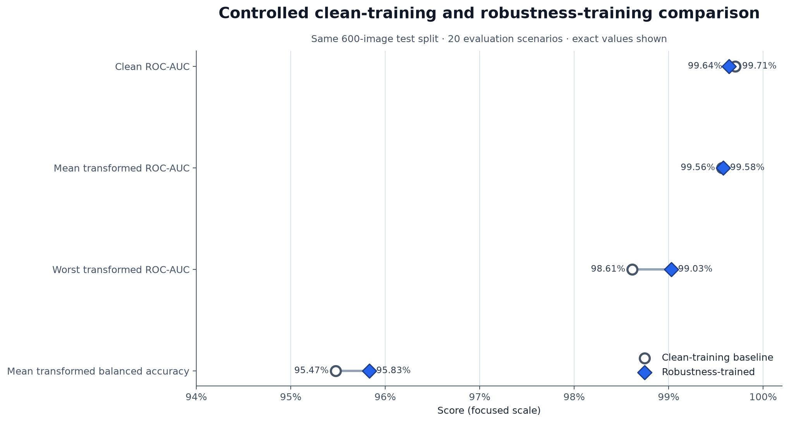

# RealityCheck — Robust AI-Generated Image Detection

RealityCheck is a hackathon-scale image classifier that estimates whether an
image is AI-generated and measures whether that score remains stable after
ordinary social-media transformations. It treats robustness as a first-class
result rather than reporting clean-image accuracy alone.

The prototype uses an ImageNet-pretrained EfficientNet-B0 binary classifier
(well below the 2-billion-parameter limit), deterministic transformation tests,
and a CPU-friendly Streamlit demo. It is a screening aid—not proof of image
provenance.

## What makes the project useful

- One required batch command emits an AIGC confidence for every image.
- The complete challenge grid covers JPEG compression, blur, rescaling, noise,
  brightness/contrast/saturation jitter, and center cropping.
- A clean baseline and robustness-trained model are evaluated on the same held-
  out images, revealing whether augmentation improves stability rather than only
  clean performance.
- The interactive **robustness passport** shows how one upload's score changes
  under every configured edit and identifies the most destabilizing case.
- Dataset preparation is balanced, duplicate-aware, source-grouped, and small
  enough for a free Kaggle GPU workflow.
- A shared short-edge resize and center crop preserves aspect ratio across
  training, evaluation, CLI inference, and Streamlit instead of stretching
  differently shaped source images into a class-correlated shortcut.

## Zero-cost architecture

```text
Hugging Face SID_Set stream
        │  6,000 selected images (labels 0 and 1 only)
        ▼
grouped train / val / test manifest
        │
        ├── clean EfficientNet-B0 baseline
        └── robustness-trained EfficientNet-B0 ──► final .safetensors checkpoint
                                                    │
                 full clean + transform evaluation ◄┘
                                                    │
                        CLI JSON + Streamlit CPU demo
```

- Training/evaluation: Kaggle Notebook with its free GPU quota.
- Demo hosting: Streamlit Community Cloud free tier.
- Data: streamed from the public
  [`saberzl/SID_Set`](https://huggingface.co/datasets/saberzl/SID_Set) dataset;
  the script stops once the requested balanced subset is complete instead of
  downloading the full 140 GB collection.
- No paid API, database, storage service, or inference endpoint is required.

Free services can impose quotas, sleep when idle, or change availability. The
local demo and recorded video remain the reliable submission fallback.

## Verified held-out results

The final controlled Kaggle run used 6,000 balanced SID_Set images and evaluated
both models on the same 600-image test split under the complete 20-scenario
clean and transformation grid.

| Result | Clean baseline | Robustness-trained | Robust-model difference |
| --- | ---: | ---: | ---: |
| Clean ROC-AUC | 0.997056 | 0.996400 | -0.000656 |
| Mean transformed ROC-AUC | 0.995635 | 0.995784 | +0.000149 |
| Worst transformed ROC-AUC | 0.986133 | 0.990278 | +0.004144 |
| Mean transformed balanced accuracy | 95.47% | 95.83% | +0.36 pp |

The defensible gain is improved worst-case resilience, not universal model
superiority. Both models are weakest under Gaussian noise at `sigma=0.10`; the
robust model improves balanced accuracy there from 84.67% to 89.00%. It is
slightly worse on clean ROC-AUC and wins ROC-AUC in 8 of 20 scenarios. See the
full [`evaluation and error analysis`](docs/submission/error-analysis.md), the
[`controlled model comparison`](artifacts/figures/model_comparison.png), and the exported
[`run context`](artifacts/metrics/run_context.json).



### Post-lock external demonstration result

After checkpoint and threshold lock, the clean WildFake demonstration run
evaluated the exact 13,841-row organizer subset (4,998 COCO val2017 real and
8,843 Advanced DALL-E 3 generated):

| ROC-AUC | Average precision | Balanced accuracy | F1 | FPR | FNR | Brier score |
| ---: | ---: | ---: | ---: | ---: | ---: | ---: |
| 0.8554 | 0.9175 | 0.7689 | 0.7630 | 0.1212 | 0.3409 | 0.1922 |

At the unchanged `0.50` threshold, the confusion counts are 4,392 true
negatives, 606 false positives, 3,015 false negatives, and 5,828 true
positives. This is a demonstration on one external subset, not a universal
performance claim. The byte-level audit found 1,808 same-label duplicate groups
containing 5,124 additional file rows, leaving 8,717 unique content hashes;
metrics retain every organizer row to preserve the exact requested subset and
therefore do not represent 13,841 independent images.

See the sanitized [`WildFake demonstration report`](docs/submission/wildfake-demo-report.md),
[`aggregate JSON`](artifacts/metrics/wildfake_demo_summary.json), and
[`clean-result figure`](artifacts/figures/wildfake_demo.png). WildFake was used
only after model and threshold lock and never for training, threshold selection,
or model selection.

## Repository layout

```text
app/                  Streamlit robustness-passport demo
configs/              Clean and robustness-training configurations
data/                 Provenance docs and ignored runtime images/manifests
notebooks/            Fail-closed Kaggle training/evaluation notebook
scripts/              Dataset and presentation helpers
src/data/             Validated manifest-backed dataset
src/transforms/       Deterministic challenge transformation grid
src/models/           EfficientNet-B0 detector and safe checkpoint helpers
src/training/         Config-driven training and early stopping
src/evaluation/       Metrics, complete robustness evaluation, and plot
src/inference/        Predictor API and required directory-to-JSON CLI
tests/                Unit and contract tests
artifacts/            Selected checkpoint and compact public evidence
```

## Reproduce the workflow

Create an environment and install the training dependencies (platform-specific
activation commands are in [`SETUP.md`](SETUP.md)):

```bash
python -m pip install -r requirements-train.txt
```

Stream a balanced 6,000-image subset and create `train`, `val`, and `test`
splits. Labels are 0 (real) and 1 (fully synthetic); SID label 2 (tampered) is
excluded.

```bash
python scripts/prepare_sid_subset.py --total 6000 --seed 42
```

Train the baseline and robustness-aware model:

The two configurations use the same seed, data, trainable backbone block,
optimizer settings, and epoch budget. Their only experimental difference is
whether robustness transformations are sampled during training.

```bash
python -m src.training.train --config configs/train_clean.yaml
python -m src.training.train --config configs/train_robust.yaml
```

Evaluate the selected checkpoint on clean images and every published transform
severity:

```bash
python -m src.evaluation.evaluate \
  --manifest data/processed/manifest.csv \
  --checkpoint artifacts/checkpoints/model.safetensors \
  --split test \
  --output-dir artifacts/metrics
```

### Post-lock WildFake demonstration benchmark

The external benchmark is deliberately separate from training and internal
model selection. Its downloader pins WildFake revision
`18f53ff36ad9da60644039f0452b0e7b3907af6f`, verifies the two source metadata
files, and retrieves only the contiguous ZIP ranges containing 4,998 COCO
`val2017` images and 8,843 Advanced DALL-E 3 images. Original encoded image
bytes are preserved.

```bash
python scripts/download_wildfake_demo.py
python scripts/evaluate_wildfake_demo.py
```

The recommended command evaluates clean images only with the frozen checkpoint
and fixed `0.50` threshold. The optional complete 20-scenario run is:

```bash
python scripts/evaluate_wildfake_demo.py --mode full
```

Local manifests, predictions, raw metrics, execution metadata, and all images
remain ignored. A completed evaluation generates a sanitized aggregate JSON,
Markdown report, and figure suitable for public evidence. The evaluator rejects
changed checkpoint bytes, wrong class counts, duplicate or conflicting image
hashes, corrupt images, and a dataset digest that differs from the downloader's
verified manifest.

For the intended free GPU run, upload
[`notebooks/train_kaggle.ipynb`](notebooks/train_kaggle.ipynb) to Kaggle, enable
a GPU and internet, and run all cells. The notebook validates both model runs,
the metrics, and a checkpoint inference before creating `hackathon_export.zip`.
Extract that ZIP into the repository root; `.gitignore` exposes only the compact
final checkpoint, manifest/provenance, metrics, predictions, and plots that are
useful for the public submission. Raw images and intermediate runs stay ignored.

## Required batch inference

```bash
python -m src.inference.cli \
  --input path/to/images \
  --output predictions.json \
  --checkpoint artifacts/checkpoints/model.safetensors
```

The output is a deterministically ordered JSON array whose records contain
exactly:

```json
{"image_path": "path/to/image.png", "pred": 0.8732}
```

`pred` is the model's estimated probability that the image is AI-generated.

## Run and host the demo

After placing the trained checkpoint at
`artifacts/checkpoints/model.safetensors`:

```bash
python -m pip install -r requirements.txt
streamlit run app/streamlit_app.py
```

For Streamlit Community Cloud, select this GitHub repository and set the app
entrypoint to `app/streamlit_app.py`. No secrets are required. Confirm the
public URL with both an authentic and generated test image before recording the
demo; deployment is not considered verified until that smoke test passes.

## Data isolation and provenance

The SID_Set dataset card lists CC BY 4.0 and documents labels 0 (real), 1 (full
synthetic), and 2 (tampered). Full provenance, normalization, leakage controls,
and attribution notes are in [`data/README.md`](data/README.md).

The organizer-provided WildFake demonstration subset is reserved for post-lock
demonstration/evaluation. It was not and must not be used for training,
threshold selection, or model selection. See the exact immutable subset and
audit rules in [`data/README.md`](data/README.md).

## Current verified status

- Core training, inference, transformation, evaluation, and Streamlit code is
  integrated.
- The final Kaggle T4 run completed against repository commit `e32257d`. Its
  selected checkpoint, manifest, metrics, predictions, provenance, and figures
  are included in the public repository.
- The 6,000-row manifest is balanced and duplicate-free, with no source ID
  crossing train, validation, or test splits. Both 12,000-row prediction files
  cover all 20 scenarios and all exported metrics were independently recomputed
  with zero discrepancy.
- The Kaggle pipeline passed its CUDA checkpoint smoke test before packaging.
  The promoted checkpoint also passes local CPU loading/inference, the required
  directory-to-JSON CLI, the complete repository test suite, and a headless Streamlit
  health check. The remaining external gates are the public Streamlit
  deployment, two-image live smoke test, demo video, and final Devpost links.

See [`docs/submission/requirements-checklist.md`](docs/submission/requirements-checklist.md)
for the remaining evidence and submission gates.
